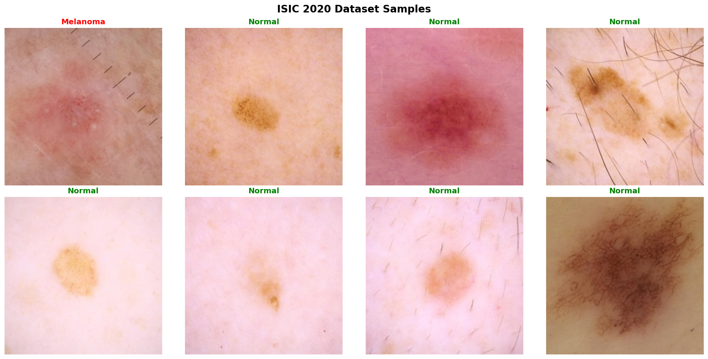
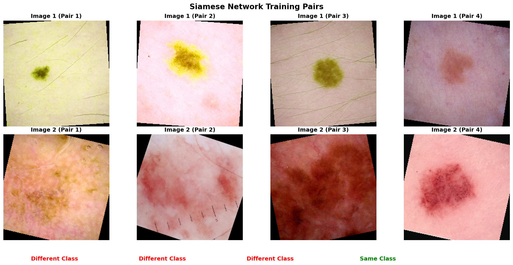

# ISIC 2020 Siamese Network Melanoma Classifier

A deep learning solution for melanoma detection using Siamese neural networks on the ISIC 2020 Kaggle Challenge dataset.

## Overview

This project implements a **Siamese Network** for binary classification of dermoscopic images to distinguish between normal skin lesions and melanoma. The approach uses one-shot learning techniques to achieve robust classification performance on the highly imbalanced ISIC 2020 dataset.

### Problem Statement
- **Dataset**: ISIC 2020 Kaggle Challenge dermoscopic images
- **Task**: Binary classification (Normal vs Melanoma)  
- **Challenge**: Severe class imbalance (98.8% normal, 1.2% melanoma)
- **Target**: ~80% accuracy on test set
- **Difficulty**: Hard (COMP3710 Project 9)

## Algorithm Description

### Siamese Network Architecture
Siamese networks learn to distinguish between pairs of images by learning a similarity function. The network consists of:

1. **Twin CNNs**: Two identical convolutional neural networks that share weights
2. **Feature Extraction**: Each branch extracts feature representations from input images  
3. **Distance Calculation**: Computes similarity/distance between feature vectors
4. **Classification**: Determines if image pairs belong to the same class or different classes

### Key Advantages for Medical Imaging
- **Few-shot Learning**: Effective with limited positive samples (melanoma cases)
- **Robust Features**: Learns discriminative representations despite class imbalance
- **Transfer Learning**: Can leverage features learned from paired training
- **Interpretability**: Distance-based decisions provide explainable results

## Dataset Implementation

### Dataset Structure
```
archive/
├── train-metadata.csv          # Image IDs and labels (33,126 samples)
└── train-image/image/          # Dermoscopic images (.jpg format)
```

### Data Distribution
| Split      | Total   | Normal  | Melanoma | Percentage |
|------------|---------|---------|----------|------------|
| **Train**  | 23,188  | 22,780  | 408      | 70%        |
| **Val**    | 4,969   | 4,881   | 88       | 15%        |
| **Test**   | 4,969   | 4,881   | 88       | 15%        |
| **Total**  | 33,126  | 32,542  | 584      | 100%       |

### Dataset Classes

The `dataset.py` module implements two main classes:

#### 1. `ISICDataset` - Regular Classification Dataset
```python
# Standard PyTorch dataset for individual image classification
dataset = ISICDataset(
    csv_file="train-metadata.csv",
    img_dir="train-image/image/", 
    transform=transforms,
    split='train'
)
```

#### 2. `ISICSiameseDataset` - Paired Training Dataset  
```python
# Generates pairs for Siamese network training
siamese_dataset = ISICSiameseDataset(
    base_dataset=base_dataset,
    num_pairs_per_epoch=10000
)
```

### Data Preprocessing & Augmentation

**Training Transforms** (with augmentation):
- Resize to 224×224 pixels
- Random horizontal/vertical flips (50% probability)
- Random rotation (±20 degrees)  
- Color jitter (brightness, contrast, saturation, hue)
- ImageNet normalization

**Validation/Test Transforms** (no augmentation):
- Resize to 224×224 pixels
- ImageNet normalization only

### Sample Data Visualization


*Representative samples from the ISIC 2020 dataset showing normal skin lesions (green) and melanoma cases (red)*


*Example training pairs for Siamese network: same class pairs (green) teach similarity, different class pairs (red) teach dissimilarity*

## Dependencies & Requirements

### Core Dependencies
```
torch>=1.9.0
torchvision>=0.10.0
numpy>=1.21.0
pandas>=1.3.0
Pillow>=8.3.0
matplotlib>=3.4.0
scikit-learn>=0.24.0
```

### Installation
```bash
# Create virtual environment
python -m venv .venv
source .venv/bin/activate  # On macOS/Linux
# .venv\Scripts\activate   # On Windows

# Install dependencies  
pip install torch torchvision numpy pandas Pillow matplotlib scikit-learn
```

## Usage Examples

### Basic Dataset Loading
```python
from dataset import get_data_loaders

# Create data loaders
data_loaders = get_data_loaders(
    data_root="../archive",
    batch_size=32,
    image_size=224,
    use_siamese=True  # For Siamese training
)

# Access loaders
train_loader = data_loaders['train']  # Siamese pairs
val_loader = data_loaders['val']      # Individual images  
test_loader = data_loaders['test']    # Individual images
```

### Iterate Through Siamese Pairs
```python
for img1, img2, pair_label in train_loader:
    # img1, img2: torch.Tensor [batch_size, 3, 224, 224]
    # pair_label: torch.Tensor [batch_size] (1=same class, 0=different class)
    print(f"Batch shapes: {img1.shape}, {img2.shape}")
    print(f"Same class pairs: {(pair_label == 1).sum()}")
    break
```

### Class Weight Calculation
```python
# Handle class imbalance with weighted loss
dataset = ISICDataset(csv_file, img_dir, transform)
class_weights = dataset.get_class_weights()
print(f"Class weights: {class_weights}")  # [0.727, 40.57] for normal/melanoma
```

## Data Splits & Reproducibility

### Stratified Splitting
- **Stratification**: Maintains class distribution across all splits
- **Random Seed**: `random_state=42` ensures reproducible splits
- **Split Files**: Automatically saved as `train_split.csv`, `val_split.csv`, `test_split.csv`

### Handling Class Imbalance
1. **Weighted Loss**: Use `class_weights` in loss function
2. **Balanced Sampling**: Siamese pairs ensure 50/50 same/different class distribution  
3. **Data Augmentation**: Aggressive augmentation for minority class (melanoma)
4. **Evaluation Metrics**: Focus on precision, recall, F1-score rather than accuracy

## File Structure
```
ISIC_Siamese_47057111/
├── dataset.py              # Main dataset implementation
├── modules.py              # Siamese network architecture (TODO)
├── train.py                # Training pipeline (TODO) 
├── predict.py              # Inference script (TODO)
├── utils.py                # Helper functions (TODO)
├── test_dataset.py         # Dataset validation script
├── create_samples.py       # Sample visualization generator
├── dataset_samples.png     # Sample images visualization
├── siamese_pairs.png       # Siamese pairs visualization
└── README.md               # This documentation
```

## Testing & Validation

### Run Dataset Tests
```bash
cd recognition/ISIC_Siamese_47057111
python test_dataset.py
```

**Expected Output:**
```
✓ Regular dataset loaded successfully
✓ Siamese pairs generated successfully  
✓ Image transformations working correctly
✓ Class balance maintained in splits
DATASET TESTING COMPLETED SUCCESSFULLY!
```

### Performance Benchmarks
- **Loading Speed**: ~0.1s per batch (batch_size=32)
- **Memory Usage**: ~2GB RAM for full dataset metadata
- **Augmentation**: Real-time transforms during training
- **Reproducibility**: Deterministic splits with fixed random seed

## Next Steps

1. **Model Architecture** (`modules.py`): Implement Siamese CNN with ResNet backbone
2. **Training Pipeline** (`train.py`): Contrastive loss, learning rate scheduling  
3. **Evaluation** (`predict.py`): Test set inference, ROC curves, confusion matrix
4. **Hyperparameter Tuning**: Grid search for optimal learning rate, margin, architecture

## References & Citations

- **ISIC 2020 Challenge**: [Kaggle Competition](https://www.kaggle.com/c/siim-isic-melanoma-classification)
- **Siamese Networks**: Koch et al. "Siamese neural networks for one-shot image recognition" (2015)
- **Dataset**: Rotemberg et al. "A patient-centric dataset of images and metadata for identifying melanomas using clinical context" (2021)

---

**Author**: Matilda Damman (47057111)  
**Course**: COMP3710 - Pattern Analysis  
**University**: The University of Queensland  
**Year**: 2024
