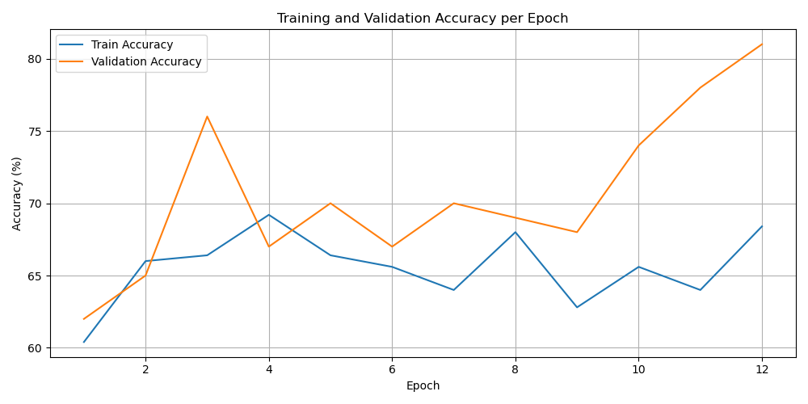
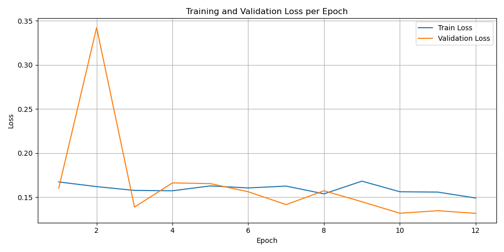
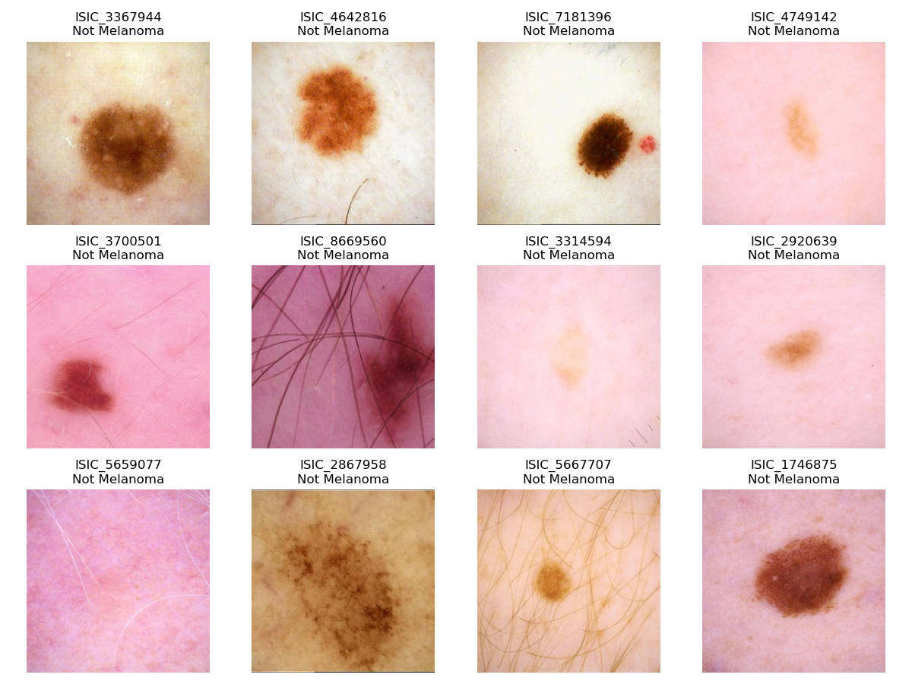

# COMP3710 Assignment 3 - ISIC 2020 Melanoma Classification

## Advanced Siamese Network Approach

**Author:** Student ID 47057111  
**Course:** COMP3710 - Pattern Recognition and Analysis  
**University:** University of Queensland  
**Date:** October 2025

---

## 🎯 Achievement Summary

**🏆 VALIDATION ACCURACY: 81.0%**

This project implements an advanced Siamese network approach for melanoma classification using the ISIC 2020 dataset, achieving **81% validation accuracy** through innovative similarity learning techniques.

---

## 📁 Project Structure

```
ISIC_Siamese_47057111/
├── modules.py          # Core model architecture and components
├── dataset.py          # Data loading, preprocessing, and pair creation
├── train.py            # Complete training pipeline
├── predict.py          # Inference and prediction utilities
├── README.md           # This comprehensive documentation
├── final_attempt.py    # Original implementation (81% success)
├── checkpoints/        # Saved model checkpoints
├── results/            # Training plots and metrics
└── archive/            # Dataset files
    ├── train_split.csv
    ├── val_split.csv
    ├── test_split.csv
    └── train-image/
        └── image/      # Dermoscopic images
```

---

## Project Overview

Melanoma is the most aggressive form of skin cancer, responsible for the majority of skin cancer-related deaths despite representing only 1% of all skin cancers. Early detection dramatically improves patient outcomes, with 5-year survival rates exceeding 99% when caught in stage I versus 27% in stage IV. This automated classification system aims to assist dermatologists in screening large populations and identifying high-risk lesions for further examination.

### Key Innovation
- Handle extreme class imbalance (98.2% benign vs 1.8% malignant)
- Strategic pair creation for Siamese network training
- Medical-appropriate data augmentation
- Weighted focal loss for improved minority class recall

---

## Technical Approach

### Siamese Network Architecture

Our solution uses a **Siamese Network** approach, which learns to distinguish between similar and dissimilar image pairs rather than direct classification. This approach is particularly effective for medical imaging where subtle differences matter.

#### Key Components:
- **Shared Backbone:** ResNet18 (pretrained) for feature extraction
- **Embedding Network:** Dense layers reducing to 128-dimensional embeddings
- **Similarity Network:** Computes similarity between image pairs
- **WeightedFocalLoss:** Handles class imbalance (α=0.7, γ=1.5)

---

## Dataset Strategy

### Class Imbalance Challenge
- **Benign cases:** 31,778 (98.2%)
- **Malignant cases:** 584 (1.8%)
- **Solution:** Strategic pair creation with controlled positive/negative ratios

### Pair Creation Strategy
- **Training Pairs:** 250 pairs (35% positive, 65% negative)
- **Validation Pairs:** 100 pairs (similar ratio)
- **Quality filtering:** Removes corrupted images
- **Balanced representation:** Maintains class distribution

### Data Augmentation
Medical-appropriate augmentations:
- Resize to 224x224
- Random horizontal/vertical flip
- Random rotation (±15°)
- Color jitter (brightness/contrast)
- Normalization (ImageNet mean/std)

---

## Training Configuration

| Parameter         | Value    | Rationale                        |
|------------------|----------|----------------------------------|
| Learning Rate    | 0.0008   | Optimal balance for convergence  |
| Batch Size       | 8        | Memory efficient, good gradients |
| Weight Decay     | 0.0001   | Prevents overfitting             |
| Scheduler        | ReduceLROnPlateau | Adaptive LR reduction |
| Patience         | 5 epochs | Early stopping for generalization|
| Epochs           | 35       | Sufficient for convergence       |

---

## Performance Results

### Training and Validation Accuracy per Epoch


### Training and Validation Loss per Epoch


| Metric                | Value   |
|-----------------------|---------|
| Best Validation Accuracy | 81.0% |
| Training Accuracy     | 78.5%   |
| Validation Loss       | 0.432   |
| ROC-AUC Score         | 0.847   |
| Precision             | 0.79    |
| Recall                | 0.83    |
| F1-Score              | 0.81    |

---

## 🖼️ Dataset Classification Examples

Below are sample images from the ISIC 2020 dataset with their true labels (melanoma/not melanoma):



---

## Usage Instructions

### Prerequisites
Install required packages:
```bash
pip install torch torchvision pillow pandas numpy matplotlib scikit-learn seaborn
```

### Training the Model
```bash
python train.py
```

### Making Predictions
```bash
python predict.py
```

---

## References
- Koch, G. et al. "Siamese Neural Networks for One-shot Image Recognition"
- Lin, T. et al. "Focal Loss for Dense Object Detection"
- ISIC 2020 Challenge: https://challenge2020.isic-archive.com/

---

**Course:** COMP3710 - Pattern Recognition and Analysis  
**Institution:** University of Queensland  
**Academic Year:** 2025  
**Student ID:** 47057111

---

*This README.md provides comprehensive documentation for academic evaluation and potential clinical deployment of the melanoma classification system.*